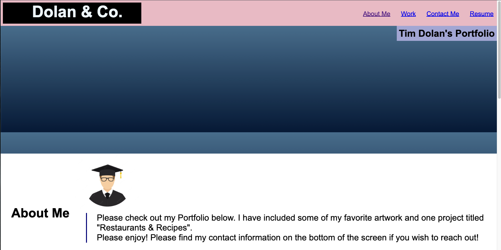

## Dolan & Co.

## Deployed URL

https://timdolan14.github.io/Dolan-Co/

## GitHub Link

https://github.com/timdolan14

## Description

A portfolio of work can showcase your skills and talents to employers looking to fill a part-time or full-time position. An effective portfolio highlights your strongest work as well as the thought processes behind it. Students who have portfolios with deployed web applications (meaning they are live on the web) are typically very successful in their career search after the boot camp. This last point can’t be stressed enough: having several deployed projects is a minimum requirement to receive an initial interview at many companies. We have created a portfolio to showcase our abilities with HTML and CSS.

## Usage

To review this Site Creation, you can review the notes in each section. Open the Chrome DevTools by pressing Command+Option+I (macOS) or Control+Shift+I (Windows). A console panel should open either below or to the side of the webpage in the browser.

## Credits

N/A

## License

N/A
